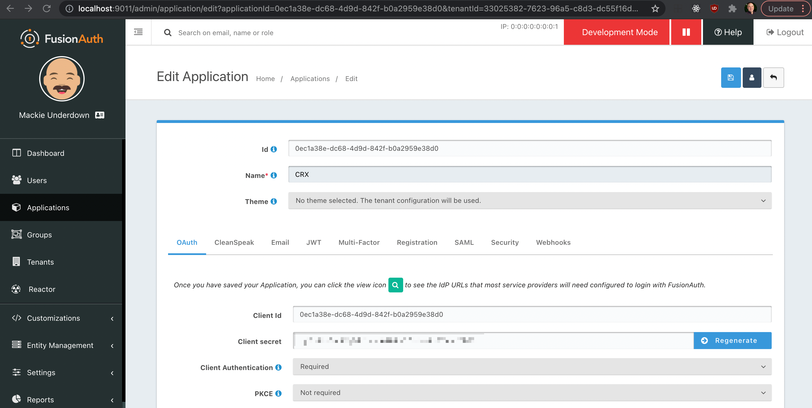

This is a [Next.js](https://nextjs.org/) project bootstrapped with [`create-next-app`](https://github.com/vercel/next.js/tree/canary/packages/create-next-app) that uses Python's [Flask](https://flask.palletsprojects.com/en/2.0.x/) micro-framework as an API.

## Getting Started

First, install the necessary Python packages to run the Flask application:

```bash
cd api
python3 -m venv env
source env/bin/activate
pip install -r requirements.txt
```

Then, within the same terminal, run the development server for the Flask application:

```bash
flask run
```

If you already have the dependencies installed and have activated your virtual environment, you can simply:

```bash
cd /path/to/project/react-crx-tutorial/api/
flask run
```

Or you can set an environment variable and run from any directory:

```bash
export FLASK_APP=/path/to/project/react-crx-tutorial/api/flask_app
flask run
```

Next, set up FusionAuth by following their [Fast Path install instructions](https://fusionauth.io/docs/v1/tech/installation-guide/fast-path/) for your operating system.

Run the `fusionauth/bin/startup.sh` script and visit http://localhost:9011 to create your admin user and any other first-time setup steps.

Create an application and make sure to take note of the client ID and client secret (environment variables you will set up later).



Also make sure to enable self-service registration in the application's Registration settings.


Next, create a FusionAuth API key with the `GET /api/user` scope enabled, which is currently required to fetch the user's roles.


You will then need to add a `.env.local` file in the root of your project with the following values:

```sh
NEXTAUTH_URL='http://localhost:3000'
FUSIONAUTH_ISSUER='http://localhost:9011/'
# The application's client ID
FUSIONAUTH_CLIENT_ID='FILL_IN'
# The application's client secret
FUSIONAUTH_CLIENT_SECRET='FILL_IN'
# The FusionAuth API key created in the previous step
FUSIONAUTH_API_KEY='FILL_IN'
FLASK_API_BASE_URL='http://localhost:5000'
# A JWT secret string - see the Next Auth docs: https://next-auth.js.org/configuration/options#jwt
JWT_SECRET='FILL_IN'
```

The `JWT_SECRET` in `.env` and `SECRET_KEY` in `api/.flaskenv` should be identical and set to the output of `jose newkey -s 512 -t oct -a HS512`. 

Then, run the development server for the React application:

```bash
npm run dev
# or
yarn dev
```

Open [http://localhost:3000](http://localhost:3000) with your browser to see the result.
